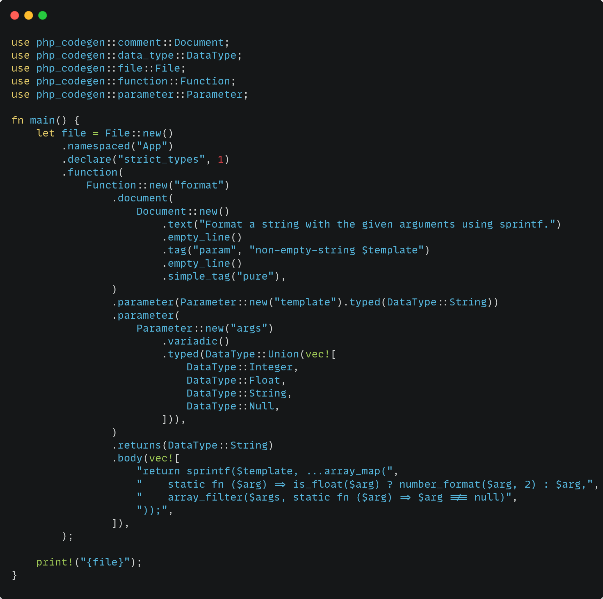
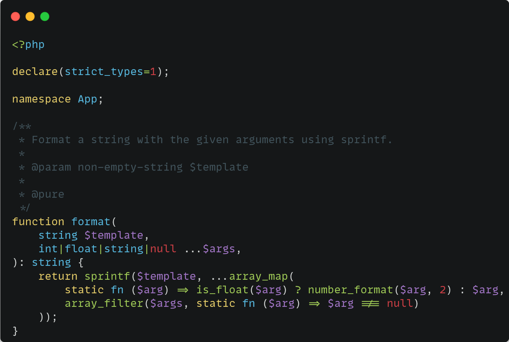

# PHP-Codegen

Generate PHP code from Rust using a fluent API 🐘 🦀

 Rust                                           | PHP
:----------------------------------------------:|:----------------------------------------------:
 | 

## Roadmap

- [x] Basic code generation
- [x] Code generation for classes
- [x] Code generation for functions
- [x] Code generation for constants
- [x] Code generation for namespaces
- [x] Code generation for declarations
- [x] Code generation for use statements
- [x] Code generation for docblocks
- [x] Code generation for properties
- [x] Code generation for methods
- [x] Code generation for parameters
- [x] Code generation for return types
- [x] Code generation for type hints
- [x] Code generation for modifiers
- [x] Code generation for visibility
- [x] Code generation for function/method bodies
- [x] Code generation for interfaces
- [ ] Code generation for enums
- [ ] Code generation for traits
- [x] Code generation for trait use statements
- [x] Code generation for variadic parameters

## License

Licensed under either of

 * Apache License, Version 2.0
   ([LICENSE-APACHE](LICENSE-APACHE) or http://www.apache.org/licenses/LICENSE-2.0)
 * MIT license
   ([LICENSE-MIT](LICENSE-MIT) or http://opensource.org/licenses/MIT)

at your option.

## Contribution

Unless you explicitly state otherwise, any contribution intentionally submitted
for inclusion in the work by you, as defined in the Apache-2.0 license, shall be
dual licensed as above, without any additional terms or conditions.